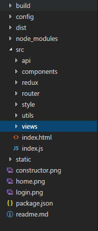
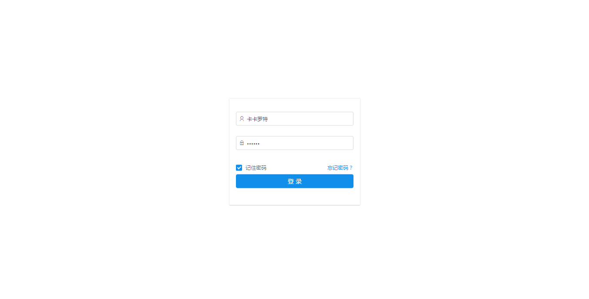
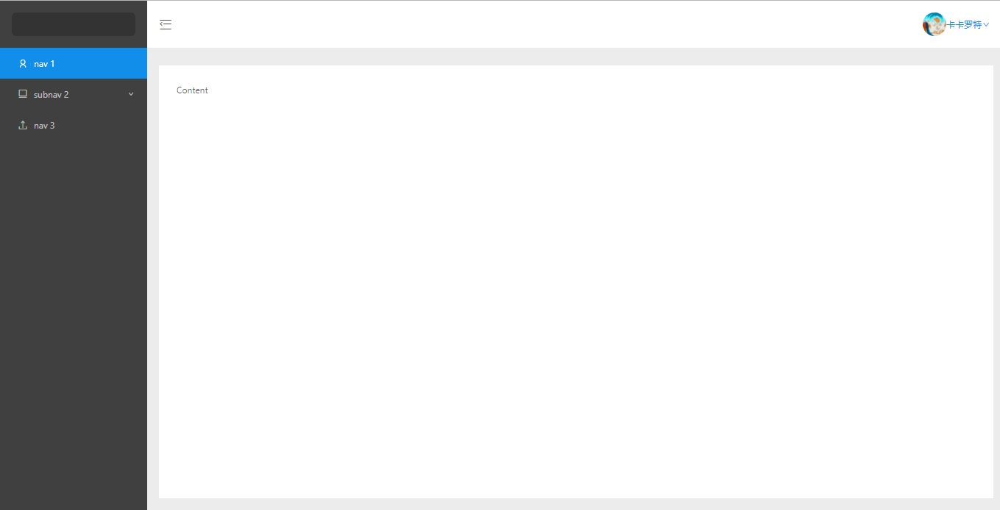

# react开发环境模版

利用vue-cli改成的react开发脚手架

## 包含技术
- react
- react-redux
- react-router-dom
- ant-design
- es6
- webpack v3.8.1

## 如何使用

### 克隆下来之后进入文件夹 npm install

### npm run dev启动开发环境

### npm run build打包生成生产环境版本

## 项目目录结构
如果你对vue-cli熟悉，那么这个结构你就不会陌生

 

## 项目图片

目前只做了登录和退出的切换，主要是分享一下改后的react开发环境脚手架

